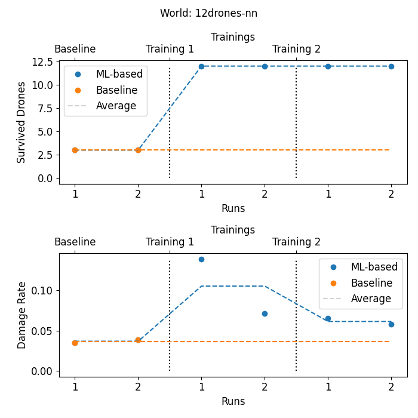
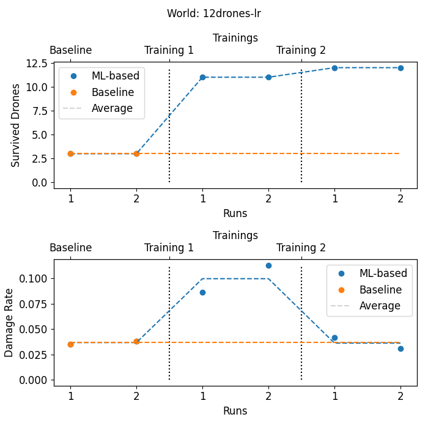
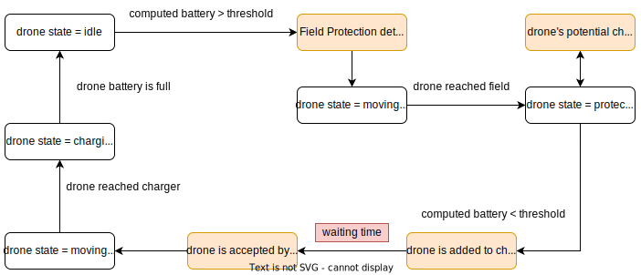

# Drone Charging Example

In this broad example, we provide a simulation that runs a system which protects field of crops against flocks of birds using battery-powered flying drones. In this document, a complete guide to run the example is presented:

- [Installation](#installation)
- [Usage](#usage)
- [Configuration](#configuration)
  - [Configuration of the simulation](#configuration-of-the-simulation)
  - [Configuration of the estimators](#configuration-of-the-estimators)
  - [Command line arguments](#Command-line-arguments)
- [Simulation &ndash; Components and Ensembles](#simulation-ndash-components-and-ensembles)

## Installation

The example requires Python 3 with `pyyaml`, `numpy`, `matplotlib`, `seaborn`, `tensorflow` and `sklearn` libraries installed.

Furthermore, `ml_deeco` shall be installed to run the simulation:

```
pip install ../ml_deeco
```

## Usage

The simulation is configured with YAML files. We split the configuration into two files &ndash; configuration of the simulation (number of drones, locations of chargers, ...) and configuration of the estimators (machine learning models).

To run the experiment, both configuration files have to be specified. Executing the following command will run an example version of the experiment with neural networks as ML models:

```
py run.py -c experiments/12drones.yaml experiments/estimators.yaml -p
```

The results will be stored in `results/12drones-nn` folder (as defined in the configuration). The `-p` switch toggles producing plots as output. The output looks like this:



Each experiment consists of several iterations (the number of iterations is specified by the `-i` option). In each iteration, the simulation is run several times (`-s` option) to collect data for training of the ML models. Then, the models are trained and another iteration begins.

A similar experiment with a linear regression model for prediction of the battery level of the drone gives slightly better results:

```
py run.py -c experiments/12drones.yaml experiments/estimators_lr.yaml -p
```



## Configuration

### Configuration of the simulation

An example of the configuration can be found in the [experiments/12drones.yaml](experiments/12drones.yaml) file.

The `name` and `output` define the name of the experiment and the output folder. However, in the examples above, these values are overridden by the configuration of the estimators.

The simulation is set to run for 500 `steps`.

In the `locals` dictionary, the configuration of the farm is defined. We set the number of `drones`, `birds`, size of the map, locations of `chargers` and `fields`, etc. The `animation` switch toggles producing GIF files with animations of the whole simulation run (note that producing the animations takes significant amount of time and storage).

### Configuration of the estimators

The specification of the machine learning models is described in the [ML-DEECo readme file](../ml_deeco/README.md#Estimator) (section *Estimator*). 
An example of the configuration can be found in the [experiments/estimators_lr.yaml](experiments/estimators_lr.yaml) file. For predicting the waiting time before a charging spot is available, we use a neural network with two hidden layers, each with 256 neurons. For predicting the future battery level of a drone, we use a linear regression model.

As the behavior of the system is influenced by the estimates, the data collected in the second iteration will be different from the first iteration.
We set the `accumulateData` parameter to `true` to use the training data from all previous iterations for training of the ML models (when it is `false`, only the data from the current iteration are used for training). This helps to prevent feedback loops in the behavior of the simulation. Note that this will increase the time needed to train the estimator, because more examples are used for training.

### Command line arguments

The YAML files are set through the `-c` command line option (as shown in the examples above).
Some configuration parameters set in the YAML files can be overridden in the command line. Here is a full list of available options: 

<pre>
usage: run.py [-h] -c CONFIGS [CONFIGS ...] [-i ITERATIONS] [-s SIMULATIONS]
              [-v VERBOSE] [--seed SEED] [--threads THREADS] [-o OUTPUT]
              [-n NAME] [-a] [-p]

Smart farming experiment with drones protecting fields against birds.

optional arguments:
  -h, --help            show this help message and exit
  -c CONFIGS [CONFIGS ...], --configs CONFIGS [CONFIGS ...]
                        the configuration file
  -i ITERATIONS, --iterations ITERATIONS
                        The number of iterations (trainings) to be performed.
  -s SIMULATIONS, --simulations SIMULATIONS
                        The number of simulation runs per iteration.
  -v VERBOSE, --verbose VERBOSE
                        the verboseness between 0 and 4.
  --seed SEED           Random seed.
  --threads THREADS     Number of CPU threads TF can use.
  -o OUTPUT, --output OUTPUT
                        The output folder
  -n NAME, --name NAME  The name of the experiment
  -a, --animation       Toggles saving the final results as a GIF animation.
  -p, --plot            Toggles saving the plot results.
</pre>

## Simulation &ndash; Components and Ensembles

The simulation runs a number of stateful and stateless component that perform in each time step:

### Overview

* Components (stateful)
    * Agents (stateful components that can move)
        * [Drone](#Drone)
        * [Bird](#Bird) &ndash; represents a flock of birds
    * [Charger](#Charger)
* Ensembles (stateless)
    * [Drone Charging](#Drone-Charging)
    * [Field Protection](#Field-Protection)
* World configuration
  * World, Environment &ndash; hold the world configuration.
  * [Field](#field) 

#### Utilities

* Run file ([`run.py`](run.py))
* Plots generator ([`utils/plots.py`](utils/plots.py))
* Average Log ([`utils/average_log.py`](utils/average_log.py)) &ndash; logging of simulation progress.
* Visualizer ([`utils/visualizers.py`](utils/visualizers.py)) &ndash; animations generator.

### Field
The field class instances represent the agricultural fields on the map. Each field has a number of crops to be protected. The fields are divided into places (based on the protection radius of drones). To simplify the simulation, the fields are presented as rectangles,: `[x1, y1, x2, y2]`

```text
    (x1,y1) .__________
            |          |
            |__________|.(x2,y2). 
```

### Drone
The drones protect the fields from birds by moving to the field and scaring the flocks of birds away. In programming perspective, drone components have access to shared `WORLD` and they can find the position to protect. In a real-life scenario, it is assumed that additional sensors will perform the detection of birds (this can be realized in the `Field` component), and it can be read from them. The drones have the following states:

#### Drone State
* **IDLE**: default initial state of a drone.
* **PROTECTING**: the drone is protecting a field.
* **MOVING_TO_CHARGING**: the drone is moving towards a charger.
* **CHARGING**: the drone is being charged.
* **TERMINATED**: the battery level of the drone is below 0, and it does not operate any more (unrecoverable).

### Bird
The birds are the threats to the crops in the fields. They find undamaged crops and eat them in one or multiple visits (2 in our case). They flee to random place of the map (which are not fields) if they see a drone around. The behavior of birds is randomized which influences the results of the simulation, thus one ought to attempt multiple runs and average the results. The birds state goes as the following:

#### Bird State
* **IDLE**: default state of birds, when they are away from fields.
* **ATTACKING**: a state where a bird has targeted a field, and it is attacking it.
* **FLEEING**: a state where a bird is flying away from drones.

### Charger
chargers are the components that provide energy to the drones. The capacity of charger is calculated according to the number of drones and chargers available. The charging rate and saturation (available charging rate) is configured in YAML files. For current existing configuration (assuming energy provided is `0.04`), charging is set as:

| Experiment | Chargers | Calculated Capacity | Maximum Charging Rate |
|-----------:|:--------:|:-------------------:|:---------------------:|
|   8 Drones |    3     |          1          |         0.12          |
|  10 Drones |    3     |          1          |         0.12          |
|  12 Drones |    3     |          1          |         0.12          |
|  16 Drones |    2     |          2          |         0.16          |
|  20 Drones |    3     |          2          |         0.24          |
|  24 Drones |    3     |          2          |         0.24          |


### Field Protection

The field protection ensemble manages the protection of the fields against the birds. There is one instance of the `FieldProtection` ensemble for each field on the map. The closest IDLE drone to each field becomes member of the ensemble and is assigned the task to protect the field. The fields are sorted based on the number of unprotected places they have (which is the total number of places minus the number of protecting drones); therefore, the priority goes as `unprotected_places / places`. In each time step the ensembles are resorted, and re-materialized to find the idle drones to protect the fields. 

### Drone Charging

Our example has three types of ensembles to perform the drone charging. The `DroneChargingPreAssignment` partitions the drones among the chargers, so that each drone is assigned to the closest charger. The `DroneChargingAssignment` selects the drones in need of charging, and the `AcceptedDronesAssignment` groups the drones which were assigned a slot at the charger &ndash; those start moving to the charger and start charging when they get there. Once on the charger, the drone will charge until its battery is full and then its state changes to IDLE. A more detailed description of the ensembles is given later in the text.

The following graph shows the cycle of a drone and how ensembles (colored as light orange) change course of the drone. However, an ensemble does not directly change the state of a drone, it rather sets for example the `target_field` attribute of the drone to command it to protect that field. Another example is that a drone could be in need of charging, but the charger is busy, so the drone will keep its current state (perhaps protecting the field) till the accepting ensemble signals that the charger is free now. For a better performance, the drones will start moving, when they know that by the time they reach the charger, the charger will be free.



The ensemble definitions are the same in both the baseline and machine-learning-based approaches. The key difference between both approaches is the computation of the waiting time, which is used for deciding whether a drone needs charging. In the baseline, the drones do not know how long they will probably wait for a free charging slot after they close enough to the charger. However, in ML-based, the waiting time is predicted and the drones add that waiting time to the time they need to fly to charger. Therefore, even with a sufficient battery, they will move toward the chargers sooner than usual and this helps them to survive. The charging ensembles are:

#### DroneChargingPreAssignment

Finds the closest charger to a drone in each time step. Technically, we have an instance of `DroneChargingPreAssignment` for each charger, so it groups the drones for which this charger is the closest.

#### DroneChargingAssignment

The ensemble groups the drones which need charging (again, we have an instance for each charger, and we only consider the drones already selected by the corresponding `DroneChargingPreAssignment`). The decision whether a drone needs charging is done as follows:

* Baseline: `battery - energy to fly to charger < threshold`
* ML-based: `battery - (energy to fly to charger + waiting time estimate) < threshold`

To estimate the waiting time, we use a neural network (specified and trained using the ML-DEECo framework) with the following input features:

* battery
* drone_state
* charger_distance
* accepted_drones_count
* charger_capacity
* neighbor_drones_average_battery
* neighbor_drones
* potential_drones
* accepted_drones_missing_battery
* charging_drones_count
* charging_drones_missing_battery
* potential_drones_with_lower_battery
* waiting_drones_count
* waiting_drones_with_lower_battery

#### AcceptedDronesAssignment

The last ensemble selects those drones from the members of `DroneChargingAssignment` for which there is a free slot at the charger. More precisely, we accept a drone for charging, if there will be a free slot at the charger at the time the drone arrives there (assuming it starts flying towards the charger now). As soon as a drone is accepted, is starts moving toward the charger and then gets fully charged.
